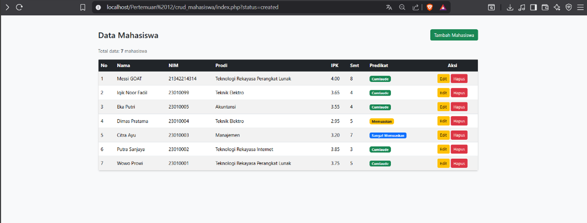

# Portofolio Praktikum Pemrograman Web 1

Kumpulan tugas Praktikum Pemrograman Web 1
Program Studi TRPL — Semester 2

---

## Tentang Saya

| Info  | Detail                     |
| ----- | -------------------------- |
| Nama  | Rafa Irhamniyansyah Achmad |
| NIM   | 25/557712/SV/26222         |
| Prodi | TRPL                       |

## Demo Live

Project CRUD: 

## Daftar Tugas

# Daftar Bab dan Topik

| Bab       | Topik                              | Folder                                             |
| --------- | ---------------------------------- | -------------------------------------------------- |
| 01 dan 02 | Pengenalan dan Dasar-Dasar HTML    | bab-01-dan-bab-02-pengenalan-dan-dasar-dasar-html/ |
| 03        | Link, Frame, dan Tabel             | bab-03-link-frame-dan-tabel/                       |
| 04        | Form dan Pengelolaan Gambar        | bab-04-form-dan-pengelolaan-gambar/                |
| 05        | Dasar CSS (Stylesheet) Bagian 1    | bab-05-dasar-css-stylesheet-bagian-1/              |
| 06        | Tata Letak dengan CSS Flexbox      | bab-06-tata-letak-dengan-css-flexbox/              |
| 07        | CSS Lanjutan (Stylesheet) Bagian 2 | bab-07-css-lanjutan-stylesheet-bagian-2/           |
| 08        | Framework Bootstrap                | bab-08-framework-bootstrap/                        |
| 09        | Penerapan dan Praktik Desain Web   | bab-09-penerapan-dan-praktik-desain-web/           |
| 10 dan 11 | JavaScript Dasar dan Lanjutan      | bab-10-dan-bab-11-javascript-dasar-dan-lanjutan/   |
| 12        | Dasar-Dasar Pemrograman PHP        | bab-12-dasar-dasar-pemrograman-php/                |
| 13 dan 14 | PHP CRUD dan Manajemen Database    | bab-13-dan-bab-14-php-crud-dan-manajemen-database/ |

## Teknologi yang Digunakan

HTML · CSS · JavaScript · PHP · MySQL · Bootstrap

## Screenshot

